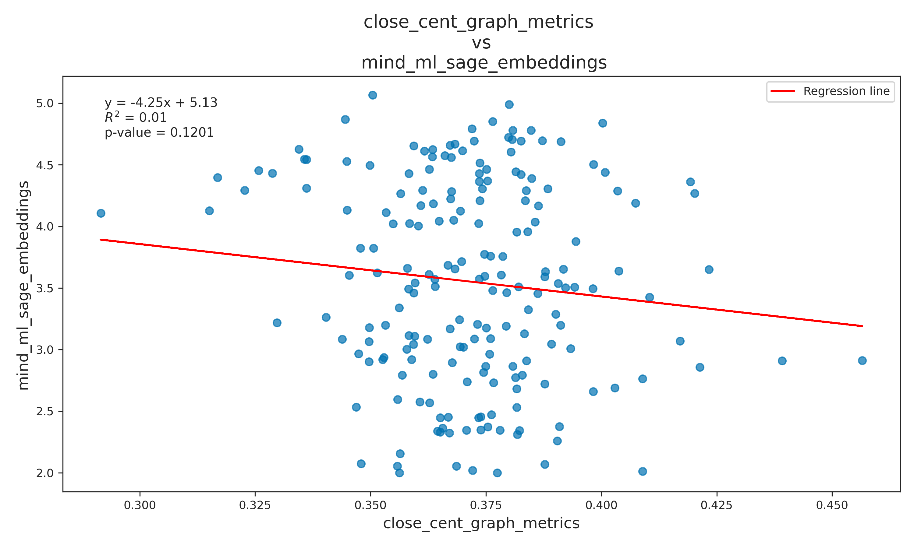

# grarepid

***

### Installations and Setup

-- Create a conda environment or a python venv environment:

``` conda create --name <my-env> ``` \
``` python3 -m venv <myenvname> ``` 

-- Install all the dependencies listed in requirements.txt file. \
  Load torch datasets correctly,\
      ``` graph = torch.load('../random_graphs/sbm_torch_5_7_7') ``` \
      ``` dataset = Planetoid(root='../real_graphs/planetoid/', name=’Cora’) 
      Graph = dataset[0] ```

\
-- Execute NC-LID algorithm from ./nclid/nclideval.py script. <br> Execute grarepid/id4geol/intrinsic_dimension_k_hops.py script for the GEOL algorithm. \
-- Execute ./embeddings/driver_sage_gat_gcn.py script to obtain graph’s node embeddings and node classification results from graphSAGE, GAT and GCN algorithms. \
-- Execute ./embeddings/driver_node2vec.py script to obtain node embeddings from Node2vec algorithm. \
-- Execute ./downstream_tasks/link_prediction.py and downstream_tasks/anomaly_detection.py to obtain results for Graph Machine Learning applications. 

-- Execute ./embed_ids/embed_skdim.py script to obtain Intrinsic Dimensionalities of the computed Embeddings obtained in steps 6 and 7. \
-- Perform analysis on results obtained in steps 4, 6, 8 and 10. 


## Visuals

.png) 

 

  

  

  


